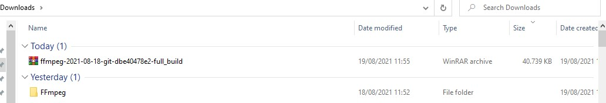
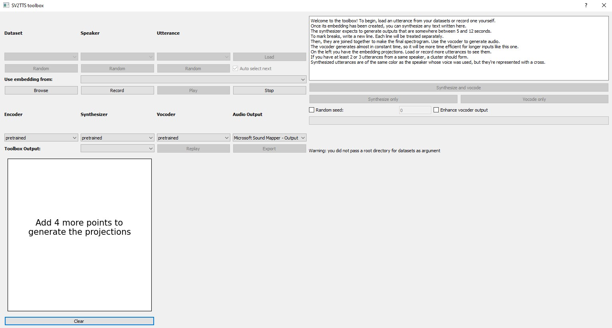
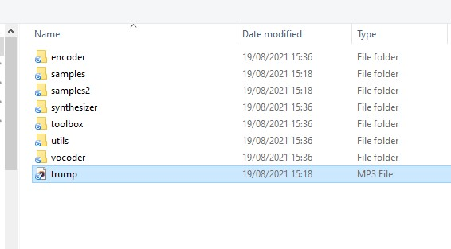
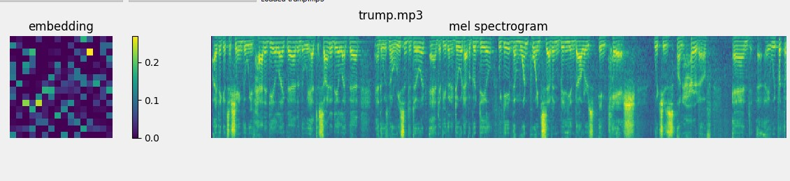
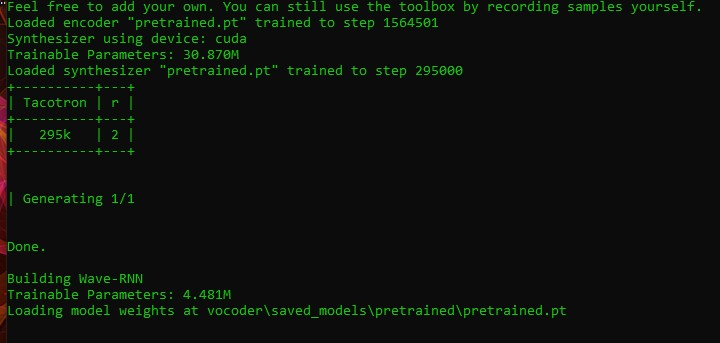
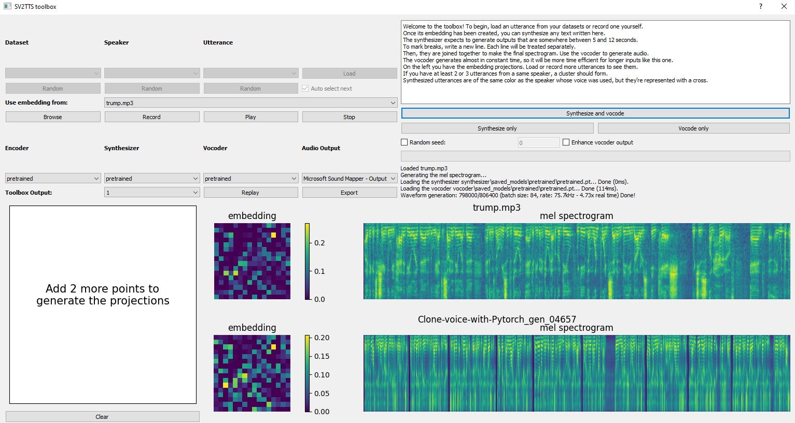

# Cloning your Voice 

Hello, today we are going toe clone your voice by using Python and Anaconda.

First you need to create a directory where you will work , enter to your terminal

```
git clone https://github.com/ruslanmv/Clone-voice-with-Pytorch.git
```

Pretrained models come as an archive that contains **all three models** (speaker encoder, synthesizer, vocoder). The archive comes with the same directory structure as the repo, and you're expected to merge its contents with the root of the repository.

```
cd Clone-voice-with-Pytorch
```

```
conda create --name clone python=3.7
```

```
conda activate clone
```

## Installing pytorch

depending where operative system you are , you choose the correct command

https://pytorch.org/get-started/locally/

If you want to know wich version of CUDA you have

```
C:\Users\username\Clone-voice-with-Pytorch>nvcc --version
```

in my case I will use CUDA 11, you can download [here](https://developer.download.nvidia.com/compute/cuda/11.4.1/local_installers/cuda_11.4.1_471.41_win10.exe) and install it, later in the terminal type

```
conda install pytorch torchvision torchaudio cudatoolkit=11.1 -c pytorch -c conda-forge
```

```
pip install -r requirements.txt 
```

```
pip install webrtcvad
```

## Install ffmpeg.

Install [ffmpeg](https://ffmpeg.org/download.html#get-packages).

In windows you download the file

[https://www.gyan.dev/ffmpeg/builds/ffmpeg-git-full.7z](https://translate.google.com/website?sl=it&tl=en&ajax=1&elem=1&se=1&u=https://www.gyan.dev/ffmpeg/builds/ffmpeg-git-full.7z) ". This will allow you to download the installation files of the latest version of FFmpeg for Windows to your computer. The files are stored in a compressed archive.




**Extract the content from the file you just downloaded.** 

- Select the **Extract here** option , then wait for the data decompression process to finish. A new folder will be created which will have the same name as the 7Z format file.


copy the folder and  paste on your "Local Disk (C :)", 

[]()

**Click on an empty spot in the right pane of the window with the right mouse button, then choose the \**Paste\** option from the context menu that will appear.** This way the folder you copied will be transferred from the directory where it is currently located to the root of your computer's hard drive.

[]()

**Access the window from which you can manage Windows environment variables.** Follow these instructions:

- Press the **Windows** + **S** key combination to access the Windows search bar;
- Click on the **Edit system-related environment variables** icon that appears in the list of results;
- Click on the **Environment Variables** button displayed in the lower right corner of the window;

[]()

**Select the variable Path listed in the "User Variables for [username]" section, then click the \**Edit\** button .** The list of paths currently assigned to the variable will be displayed.


[]()


**Add the path of the "FFmpeg" directory to the "Path" variable.** 

- Click on the **New** button to insert a new line of text after the last one in the list;
- Enter the path C:\ffmpeg\bin. If you have pasted the "FFmpeg" folder into a different memory drive or folder, you will need to replace the path indicated with the specific one in your case (remember to add the string "\ bin" at the end);
- Click on the **OK** button . At this point, the complete path of the "FFmpeg" folder will be present as the last value of the "Path" variable.

[]()

**Click on the \**OK\** button to save the changes.**

 At this point the installation of FFmpeg and the configuration of the system variables is complete.

 To ensure that FFmpeg is working properly, open a window of the "Command Prompt" and run the command to display on screen the program version number: 

```
ffmpeg -version
```

```
libavutil      57.  4.101 / 57.  4.101
libavcodec     59.  5.100 / 59.  5.100
libavformat    59.  4.101 / 59.  4.101
libavdevice    59.  0.101 / 59.  0.101
libavfilter     8.  2.100 /  8.  2.100
libswscale      6.  0.100 /  6.  0.100
libswresample   4.  0.100 /  4.  0.100
libpostproc    56.  0.100 / 56.  0.100
```

### Test Configuration

Before you download any dataset, you can begin by testing your configuration with:

```
python demo_cli.py
```

If all tests pass, you're good to go.

```
python demo_toolbox.py
```




Then we click the **browse button** and select at least **5 seconds**  to 12 second of sound that you want to clone.

For example from an interview of Donald Trump you can listen [here](https://soundcloud.com/ruslanmv/trump) 




and you will obtain the spectrogram and embedding of Donald Trump




and then click  **synthesize and vocode**





The synthesizer expects to generate outputs that are somewhere between 5 and 12 seconds.

To mark breaks, write a new line. Each line will be treated separately.

Then, they are joined together to make the final spectrogram. Use the vocoder to generate audio.

The vocoder generates almost in constant time, so it will be more time efficient for longer inputs like this one.

On the left you have the embedding projections. Load or record more utterances to see them.

If you have at least 2 or 3 utterances from a same speaker, a cluster should form.

Synthesized utterances are of the same color as the speaker whose voice was used, but they're represented with a cross.

You will obtain





And you can change the text that you want to reproduce each time. You can export and save your cloned voice , [here](https://soundcloud.com/ruslanmv/trump-clone)


### (Optional) Download Datasets

For playing with the toolbox alone, I only recommend downloading [`LibriSpeech/train-clean-100`](https://www.openslr.org/resources/12/train-clean-100.tar.gz). 

Extract the contents as `<datasets_root>/LibriSpeech/train-clean-100` where `<datasets_root>` is a directory of your choosing. Other datasets are supported in the toolbox, see [here](https://github.com/CorentinJ/Real-Time-Voice-Cloning/wiki/Training#datasets). 

You're free not to download any dataset, but then you will need your own data as audio files or you will have to record it with the toolbox. You can then try the toolbox:

```
python demo_toolbox.py -d <datasets_root>`
```

depending on whether you downloaded any datasets. 


**Congratulations!** we have cloned the voice by using Pytorch.


